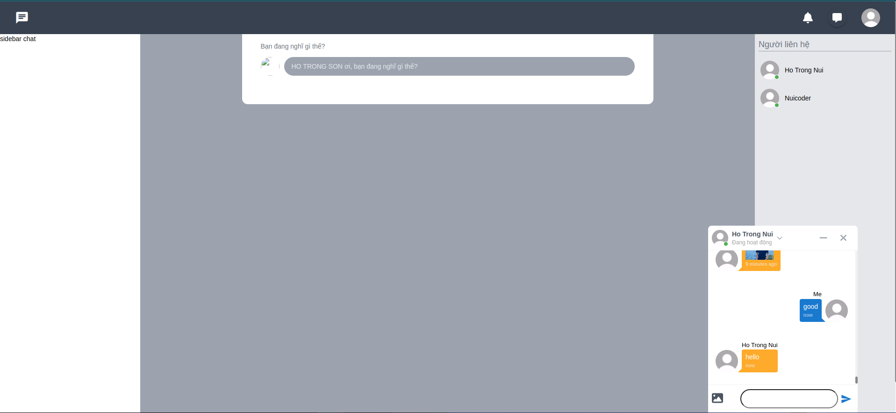
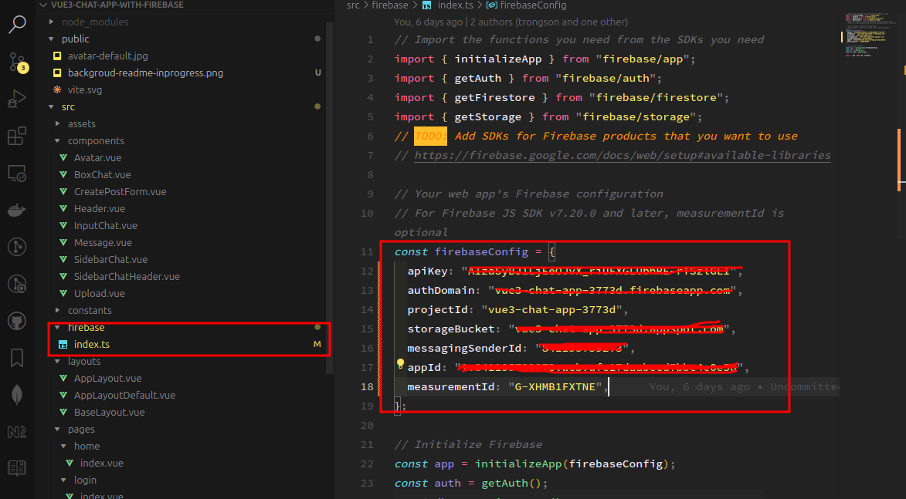

# Vue 3 + TypeScript + Vite + Quasar-Framework + UnoCSS

### Photo is under development

<div align="center">
  
</div>

### Config firebase

1. Visit here to setup new project with firebase: https://firebase.google.com/docs/web/setup
2. After setup finish => You can copy config of firebase and paste to file index.ts of folder firebase.
<div align="center">
  
</div>

### Run source:

Run the following command on your local environment:

```shell
git clone --depth=1 https://github.com/sonht113/react-boilerplate-for-starter.git
cd my-project-name
pnpm install
```

Then, you can run locally in development mode with live reload:

```shell
pnpm run dev
```

Open http://localhost:5173 with your favorite browser to see your project.

Made with ♥ by [NuiCoder](https://www.facebook.com/profile.php?id=100032736788526&locale=vi_VN)
